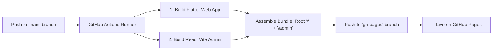

# 🚀 Automated GitHub Pages Deployment Guide

This document explains the automatic deployment pipeline configured for **HealthExpress AI**.

---

## 📌 Live URLs

| Application | Route | Live URL |
| :--- | :--- | :--- |
| **User & Doctor App** (Flutter Web) | `/` (Root) | [https://pavanstarkin-tech.github.io/healthyxpress_medha/](https://pavanstarkin-tech.github.io/healthyxpress_medha/) |
| **Admin Dashboard** (React + Vite) | `/admin` | [https://pavanstarkin-tech.github.io/healthyxpress_medha/admin/](https://pavanstarkin-tech.github.io/healthyxpress_medha/admin/) |

---

## ⚙️ How Automatic Deployment Works

We have configured a **GitHub Actions CI/CD pipeline** located at [`.github/workflows/deploy.yml`](.github/workflows/deploy.yml).

### 1. Automatic Triggers
The workflow automatically starts whenever you push code changes to the `main` branch affecting:
- `healthexpress/**` (Flutter Mobile & Web application)
- `admin_panel/**` (React Vite Admin Dashboard)
- `.github/workflows/**` (CI/CD Configuration)

You can also trigger a build manually anytime from **GitHub Repository > Actions > "Deploy to GitHub Pages (App & Admin Panel)" > Run workflow**.



---

## 🛠️ Step-by-Step CI/CD Execution

When triggered, the GitHub Actions runner performs the following steps:

1. **Flutter App Build**:
   - Sets up Flutter (stable channel).
   - Runs `flutter pub get`.
   - Runs `flutter build web --release --base-href "/healthyxpress_medha/"`.
   - Generates `.nojekyll` and copies `index.html` to `404.html` (supporting Single Page App client routing).

2. **React Admin Panel Build**:
   - Sets up Node.js (v20).
   - Runs `npm ci`.
   - Runs `npm run build` using Vite (with relative base path `./`).

3. **Combined Output Assembly**:
   - Places the Flutter Web build at the root folder (`/`).
   - Places the React Admin Panel build in the `/admin` subfolder.

4. **Deployment**:
   - Uses `JamesIves/github-pages-deploy-action@v4` with write permissions to update the `gh-pages` branch.
   - GitHub Pages serves the latest commit immediately.

---

## 🔑 GitHub Repository Settings Check

To ensure GitHub Actions has permission to push the built bundle to the `gh-pages` branch:

1. Open your repository on GitHub: [https://github.com/pavanstarkin-tech/healthyxpress_medha](https://github.com/pavanstarkin-tech/healthyxpress_medha)
2. Go to **Settings** > **Actions** > **General**.
3. Scroll down to **Workflow permissions**.
4. Select **Read and write permissions** and click **Save**.
5. Go to **Settings** > **Pages**:
   - **Source**: Deploy from a branch
   - **Branch**: `gh-pages` / `/ (root)`

---

## 💻 Optional: Local One-Click Deployment Script

If you ever wish to build and push to `gh-pages` directly from your local terminal without waiting for GitHub Actions, run this command in PowerShell:

```powershell
# 1. Build Flutter Web App
cd healthexpress
flutter build web --release --base-href "/healthyxpress_medha/"
Copy-Item build\web\index.html build\web\404.html
New-Item -ItemType File -Force -Path build\web\.nojekyll
cd ..

# 2. Build Admin Panel
cd admin_panel
npm run build
cd ..

# 3. Assemble and Push to gh-pages branch
if (Test-Path "temp_gh_pages") { Remove-Item -Recurse -Force "temp_gh_pages" }
git worktree prune
git worktree add -B gh-pages temp_gh_pages gh-pages
Get-ChildItem -Path temp_gh_pages -Exclude ".git" | Remove-Item -Recurse -Force
Copy-Item -Recurse -Force "healthexpress\build\web\*" "temp_gh_pages\"
Copy-Item -Force "healthexpress\build\web\.nojekyll" "temp_gh_pages\.nojekyll"
New-Item -ItemType Directory -Force -Path "temp_gh_pages\admin"
Copy-Item -Recurse -Force "admin_panel\dist\*" "temp_gh_pages\admin\"
cd temp_gh_pages
git add -A
git commit -m "deploy: update GitHub Pages with latest app and admin panel"
cd ..
git worktree remove temp_gh_pages --force
git push origin gh-pages --force
```

---

## 📝 Summary of Branches

- **`main`**: The primary development branch containing all source code for the Flutter app (`healthexpress/`), Admin Panel (`admin_panel/`), Backend APIs (`php_backend/`), and configuration.
- **`gh-pages`**: The production hosting branch automatically maintained by CI/CD, containing compiled static assets for both the root app (`/`) and the admin panel (`/admin`).
