# 🏥 HealthExpress AI — Intelligent Healthcare Platform & Control Center

[](https://flutter.dev)
[](https://react.dev)
[](https://vitejs.dev)
[](https://www.php.net)
[](https://mariadb.org)
[](https://www.nvidia.com)
[](https://sarvam.ai)
[](https://www.agora.io)
[](https://www.mapbox.com)
[](https://razorpay.com)
[](https://pavanstarkin-tech.github.io/healthyxpress_medha/)

> **HealthExpress AI** is an end-to-end, high-performance healthcare super-app and operational command center. It unifies **multilingual voice-first AI clinical intake (Telugu, Hindi, English)**, **embedded Agora HD video teleconsultations**, **15-minute hyperlocal dark-store emergency medicine delivery**, **home diagnostic lab test sample collections**, and **ABDM & Aarogyasri government health scheme integrations** into a single, synchronized platform.

---

## 🌐 Live Production Links

* **📱 Patient & Doctor Web App**: [https://pavanstarkin-tech.github.io/healthyxpress_medha/](https://pavanstarkin-tech.github.io/healthyxpress_medha/)
* **💻 Super Admin & Hospital Operations Dashboard**: [https://pavanstarkin-tech.github.io/healthyxpress_medha/admin/](https://pavanstarkin-tech.github.io/healthyxpress_medha/admin/)
* **🐘 Live Hostinger REST API Health**: [https://vedvaidyam.com/healthexpress/api/health](https://vedvaidyam.com/healthexpress/api/health)

---

## 📑 Table of Contents

- [1. User Interface & Screen Gallery](#1-user-interface--screen-gallery)
- [2. System Architecture](#2-system-architecture)
- [3. Core Workflows & Detailed Flowcharts](#3-core-workflows--detailed-flowcharts)
  - [A. The "Golden 15-Minute" Care Loop](#a-the-golden-15-minute-care-loop)
  - [B. Multilingual Voice AI Triage & Clinical Intake Engine](#b-multilingual-voice-ai-triage--clinical-intake-engine)
  - [C. Doctor Teleconsultation & Live E-Prescription Workflow](#c-doctor-teleconsultation--live-e-prescription-workflow)
  - [D. 15-Minute Hyperlocal Dark Store Medicine Dispatch](#d-15-minute-hyperlocal-dark-store-medicine-dispatch)
  - [E. ABDM QR Consent & Aarogyasri Health Pass Verification](#e-abdm-qr-consent--aarogyasri-health-pass-verification)
- [4. Role-Wise Capabilities & Feature Matrix](#4-role-wise-capabilities--feature-matrix)
- [5. Authoritative Production Relational Database Schema](#5-authoritative-production-relational-database-schema)
- [6. Complete REST API Endpoint Directory](#6-complete-rest-api-endpoint-directory)
- [7. Technology Stack & Directory Structure](#7-technology-stack--directory-structure)
- [8. Setup, Local Development & Deployment Guide](#8-setup-local-development--deployment-guide)

---

## 1. User Interface & Screen Gallery

### 💻 Super Admin & Hospital Operations Command Center
| Hospital & Bed Operations | Super Admin Telemetry & Metrics | Inventory & Store Verifications |
| :---: | :---: | :---: |
| 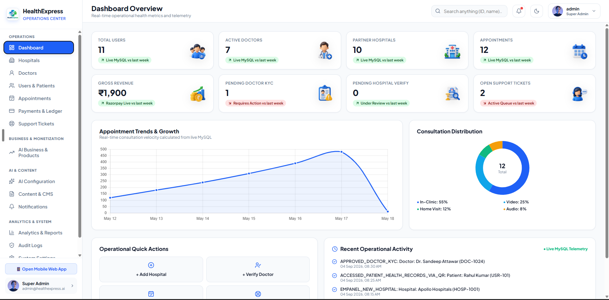 | 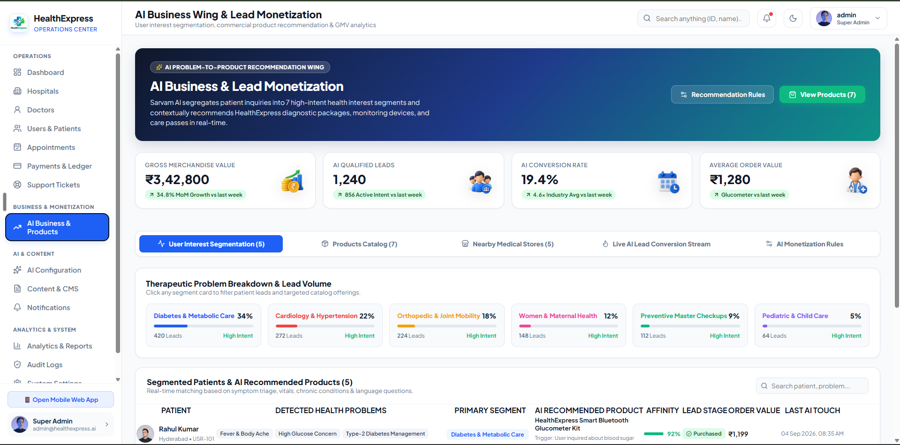 | 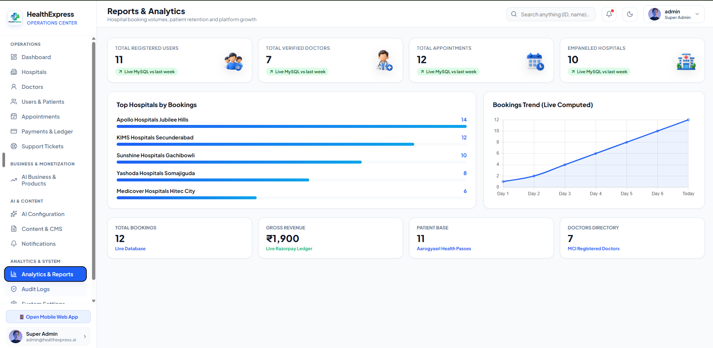 |

### 📱 Patient Super-App & Doctor Telehealth Console
| Home Care & Quick Actions | Voice AI Clinical Intake | Doctor Discovery & Booking |
| :---: | :---: | :---: |
| 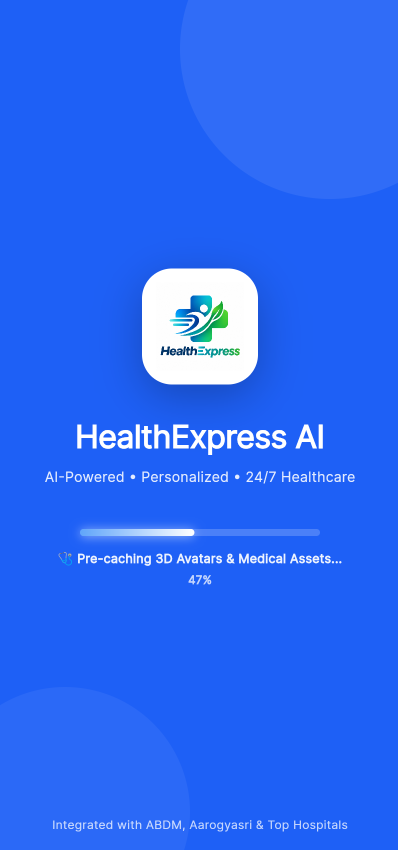 | 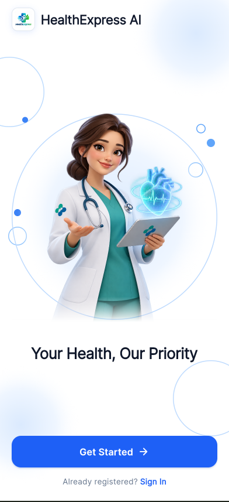 | 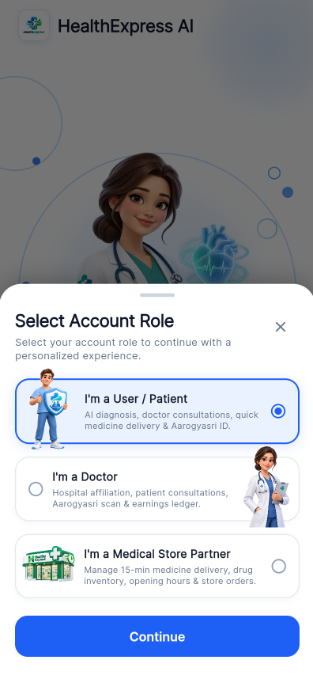 |

| 15-Min Pharmacy & Lab Tests | ABDM Health Locker & Aarogyasri |
| :---: | :---: |
| 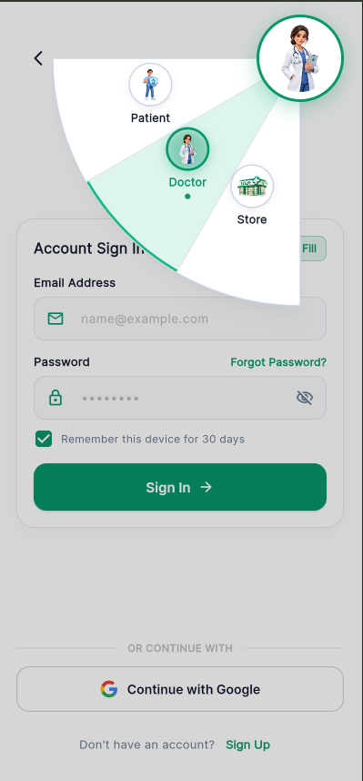 | 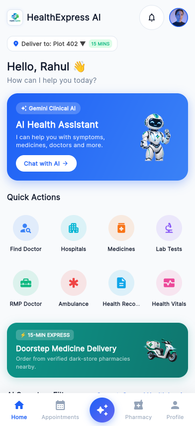 |

---

## 2. System Architecture

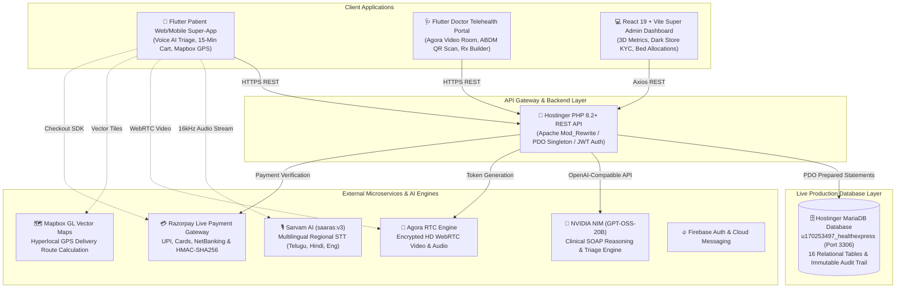

---

## 3. Core Workflows & Detailed Flowcharts

### A. The "Golden 15-Minute" Care Loop

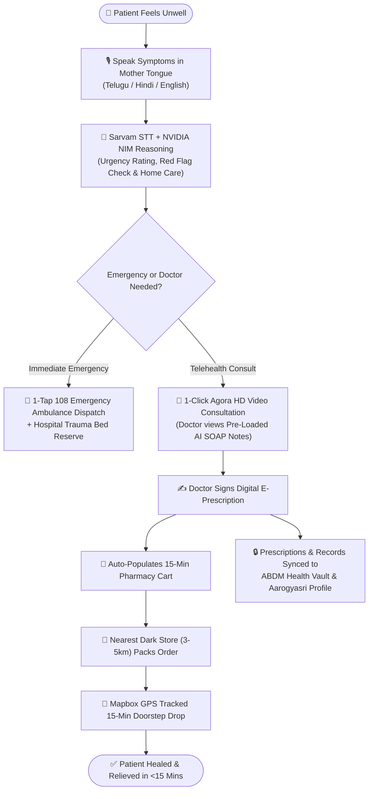

---

### B. Multilingual Voice AI Triage & Clinical Intake Engine

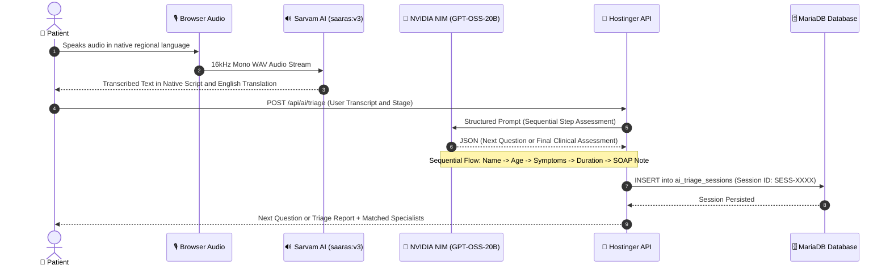

---

### C. Doctor Teleconsultation & Live E-Prescription Workflow

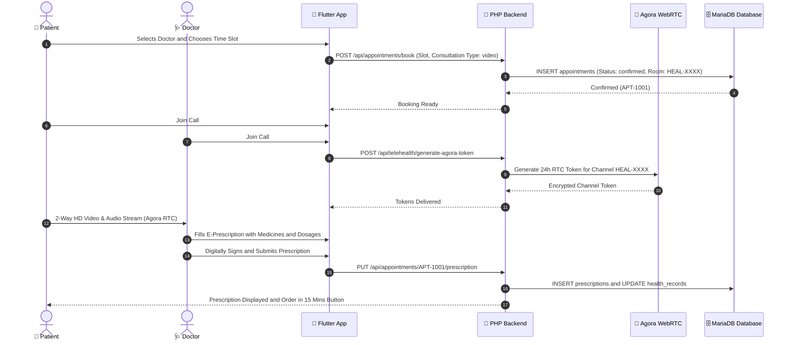

---

### D. 15-Minute Hyperlocal Dark Store Medicine Dispatch

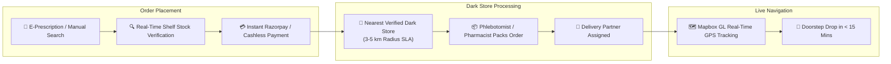

---

### E. ABDM QR Consent & Aarogyasri Health Pass Verification

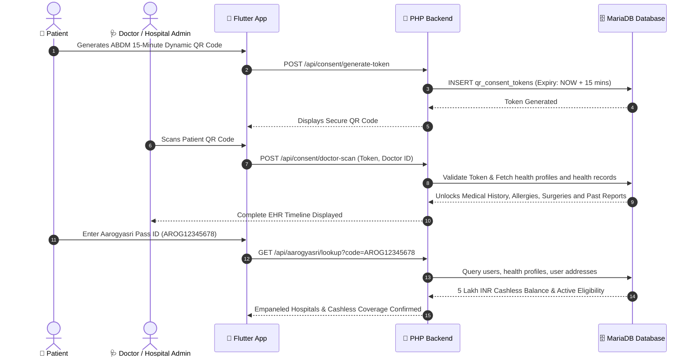

---

## 4. Role-Wise Capabilities & Feature Matrix

```
┌────────────────────────────────────────────────────────────────────────┐
│                        HealthExpress AI Roles                          │
├─────────────────┬─────────────────┬──────────────────┬─────────────────┤
│ 👤 Patient      │ 🩺 Doctor       │ 🏥 Hospital      │ 🏬 Store / Super│
│ • Voice AI      │ • Agora Video   │ • Bed Tracking   │ • 15-Min Order  │
│ • 15-Min Drops  │ • Rx Builder    │ • Admissions     │ • KYC Audit     │
│ • Aarogyasri    │ • ABDM QR Scan  │ • Empanelment    │ • API Health    │
└─────────────────┴─────────────────┴──────────────────┴─────────────────┘
```

| Role | Key Capabilities & Functionalities |
| :--- | :--- |
| **👤 Patient** | • Multilingual voice AI clinical intake in Telugu, Hindi, English.<br>• Search and filter doctors by specialty, distance, fee, and rating.<br>• Book in-clinic or instant Agora HD video consultations.<br>• 15-minute emergency medicine delivery with Mapbox live GPS tracking.<br>• Book home diagnostic lab test collection packages (CBC, Lipid, HbA1c, Dengue, Thyroid).<br>• Verify Aarogyasri health pass & generate ABDM 15-minute QR consent tokens.<br>• 1-tap emergency 108 ambulance dispatch and live hospital bed vacancy tracker. |
| **🩺 Doctor** | • Manage appointment queue (in-clinic, video, home visit).<br>• Review pre-consultation AI-generated SOAP notes and triage summaries.<br>• Conduct encrypted HD video/audio teleconsultations.<br>• Build and digitally sign E-Prescriptions with integrated dosage guidelines.<br>• Scan patient ABDM QR codes to securely access past medical histories and allergies.<br>• Configure weekly consultation schedules, slots, and fees. |
| **🏥 Hospital Admin** | • Real-time bed management: General, ICU, and Emergency Trauma beds.<br>• Manage patient admission, discharge, and emergency transfers.<br>• Maintain hospital department rosters and primary vs visiting doctor affiliations.<br>• Process Aarogyasri cashless pre-authorizations and insurance claims. |
| **🏬 Pharmacy Partner**| • Self-onboarding with Drug License, GST verification, and delivery radius (3–5 km).<br>• Live inventory catalog management with batch numbers, pricing, and stock levels.<br>• Receive instant 15-minute emergency order alerts with fast-pack workflow.<br>• Delivery rider dispatch and Mapbox route synchronization. |
| **👑 Super Admin** | • Platform-wide KPI telemetry: Total active users, doctors, hospitals, and revenue ledger.<br>• Pharmacy dark store drug license review and approval/rejection queue.<br>• Doctor Medical Council registration certificate verification.<br>• Real-time API uptime health monitor and MariaDB connectivity diagnostics. |

---

## 5. Authoritative Production Relational Database Schema

The production MariaDB database (`u170253497_healthexpress`) contains **16 normalized relational tables**:

| # | Table Name | Key Columns | Purpose |
| :---: | :--- | :--- | :--- |
| **1** | `users` | `id`, `name`, `phone`, `email`, `role`, `aarogyasri_id`, `dob`, `gender` | Primary user identity directory and authentication |
| **2** | `health_profiles` | `user_id`, `blood_group`, `allergies`, `chronic_conditions`, `past_surgeries` | Comprehensive EHR vault and clinical history |
| **3** | `user_addresses` | `id`, `user_id`, `address_line1`, `city`, `state`, `pincode`, `latitude`, `longitude` | Geolocation coordinates for 15-minute delivery routing |
| **4** | `hospitals` | `id`, `name`, `hospital_type`, `license_number`, `total_beds`, `icu_beds`, `lat`, `lng` | Empaneled hospital facility registry and GPS coordinates |
| **5** | `departments` | `id`, `hospital_id`, `name`, `description` | Hospital clinical specialty departments |
| **6** | `doctors` | `id`, `user_id`, `name`, `specialty`, `registration_number`, `consultation_fee` | Doctor medical credentials, fee, and verification status |
| **7** | `doctor_hospitals` | `doctor_id`, `hospital_id`, `department_id`, `affiliation_type` | Multi-facility doctor hospital affiliations |
| **8** | `doctor_schedules` | `doctor_id`, `day_of_week`, `start_time`, `end_time`, `slot_duration_minutes` | Weekly recurring consultation availability slots |
| **9** | `appointments` | `id`, `user_id`, `doctor_id`, `hospital_id`, `appointment_date`, `time_slot`, `fee` | Central appointment lifecycle and video room mapping |
| **10** | `prescriptions` | `id`, `appointment_id`, `medicines`, `clinical_notes`, `diagnostic_tests` | Digital signed E-Prescriptions synced to patient cart |
| **11** | `medicines` | `id`, `name`, `category`, `price`, `stock_quantity`, `requires_prescription` | 15-minute pharmacy catalog & live inventory |
| **12** | `qr_consent_tokens` | `id`, `token`, `user_id`, `expires_at`, `status`, `scanned_by` | ABDM 15-minute dynamic consent tokens |
| **13** | `health_records` | `id`, `user_id`, `record_type`, `title`, `file_url`, `created_at` | Encrypted digital medical document vault |
| **14** | `payments` | `id`, `appointment_id`, `razorpay_order_id`, `amount`, `currency`, `status` | Razorpay Live transactions and revenue ledger |
| **15** | `tickets` | `id`, `user_id`, `category`, `subject`, `description`, `status`, `priority` | 24x7 customer support dispute ticketing system |
| **16** | `chat_messages` | `id`, `sender_id`, `receiver_id`, `message`, `is_read`, `created_at` | 2-way doctor-patient encrypted clinical chat |

---

## 6. Complete REST API Endpoint Directory

All endpoints are hosted live on Hostinger at `https://vedvaidyam.com/healthexpress/api`:

| HTTP Method | Route | Description | Status |
| :--- | :--- | :--- | :---: |
| `GET` | `/health` | Live database connectivity & server status check | `200 OK` |
| `GET` | `/hospitals` | Hospital directory with proximity distance calculation | `200 OK` |
| `GET` | `/doctors` | Registered doctors with specialty & hospital affiliation | `200 OK` |
| `GET` | `/pharmacy/medicines` | 15-minute delivery medicine catalog & stock count | `200 OK` |
| `GET` | `/diagnostic/lab-tests` | Diagnostic lab test packages & fasting criteria | `200 OK` |
| `GET` | `/orders/business-products` | Home medical devices & wellness checkup packages | `200 OK` |
| `GET` | `/aarogyasri/lookup` | Real-time Aarogyasri health pass eligibility lookup | `200 OK` |
| `POST` | `/auth/register` | Quick patient registration & Aarogyasri pass generation | `200 OK` |
| `POST` | `/appointments/book` | Real-time slot booking with subsidy calculation | `200 OK` |
| `GET` | `/appointments/user/:id` | Retrieve patient appointment history & statuses | `200 OK` |
| `PUT` | `/appointments/:id/prescription`| Doctor issues digitally signed E-Prescription | `200 OK` |
| `POST` | `/telehealth/generate-agora-token`| Generates 24-hour Agora RTC WebRTC video token | `200 OK` |
| `POST` | `/consent/generate-token`| Generates 15-minute dynamic ABDM QR consent token | `200 OK` |
| `POST` | `/consent/doctor-scan` | Doctor scans QR to unlock patient clinical vault | `200 OK` |
| `POST` | `/ai/triage` | Persist and score AI clinical symptom intake | `200 OK` |
| `GET` | `/ai/sessions/user/:id` | Historical AI triage sessions & clinical SOAP notes | `200 OK` |
| `POST` | `/payments/create-order` | Create Razorpay Live payment order ID | `200 OK` |
| `POST` | `/payments/verify` | Verify Razorpay payment signature (HMAC-SHA256) | `200 OK` |

---

## 7. Technology Stack & Directory Structure

```
healthyxpress_medha/
├── 3D-ILLUS/                     # 🎨 High-resolution 3D asset source files
│   ├── ADMIN-PANAL/              # 3D illustration metrics (1.png - 8.png)
│   ├── illustratuions/           # High-resolution hero assets (health-ai.png)
│   └── user-home-quickactions/   # Patient dashboard action assets (1.png - 7.png)
│
├── ui/                           # 📸 Production screenshots for README & docs
│   ├── admin-1.png               # Hospital bed & ward operations view
│   ├── admin-2.png               # Super admin telemetry & KPI dashboard
│   ├── admin-3.png               # Dark store KYC & verification queue
│   ├── app-ui-1.png              # Patient home dashboard & quick actions
│   ├── app-ui-2.png              # Multilingual voice AI clinical triage
│   ├── app-ui-3.png              # Doctor discovery & appointment booking
│   ├── app-ui-4.png              # 15-minute pharmacy & lab tests catalog
│   └── app-ui-5.png              # ABDM digital health locker & Aarogyasri
│
├── healthexpress/                # 📱 Flutter Web & Mobile Super-App
│   ├── lib/
│   │   ├── core/config/          # Live API URLs, Keys (NVIDIA, Sarvam, Agora, Razorpay)
│   │   ├── core/theme/           # Glassmorphism design tokens & Medical Teal palette
│   │   ├── models/               # Hospital, Doctor, Medicine, Appointment, User models
│   │   ├── providers/            # Riverpod & Provider state managers (AI, Auth, Pharmacy)
│   │   ├── services/             # REST client, Agora WebRTC, Sarvam STT, NVIDIA NIM
│   │   └── screens/              # Patient & Doctor multi-role responsive screens
│   └── web/                      # PWA shell, Mapbox GL JS, Firebase Auth popup
│
├── admin_panel/                  # 💻 React 19 + Vite Super Admin Dashboard
│   ├── src/
│   │   ├── components/           # MetricCard, Modal, Navbar, Sidebar
│   │   ├── views/                # 12 Operational Workspaces (Beds, Stores, Doctors, etc.)
│   │   └── services/             # Axios REST client for live MariaDB telemetry
│   └── package.json
│
├── php_backend/                  # 🐘 Hostinger Production PHP 8.2+ REST API
│   ├── .htaccess                 # Apache mod_rewrite clean routing
│   ├── index.php                 # Front Controller & 16-route REST dispatcher
│   ├── config/                   # PDO database singleton with connection pooling
│   ├── controllers/              # 15 Specialized Controllers (Ai, Auth, Doctor, etc.)
│   └── database/schema.sql       # 16-table relational MariaDB schema
│
└── deploy.ps1                    # 🚀 Automated dual-deployment build & push script
```

---

## 8. Setup, Local Development & Deployment Guide

### A. Flutter Mobile & Web Super-App
```bash
cd healthexpress

# 1. Install Flutter dependencies
flutter pub get

# 2. Run unit & widget tests
flutter test

# 3. Launch Flutter Web locally on Chrome
flutter run -d chrome
```

### B. React 19 Super Admin Dashboard
```bash
cd admin_panel

# 1. Install NPM packages
npm install

# 2. Launch Vite development server (http://localhost:5173)
npm run dev

# 3. Build optimized production bundle
npm run build
```

### C. Automated Dual Deployment (GitHub Pages)
A single PowerShell script builds both Flutter Web and React Admin, then deploys them simultaneously to GitHub Pages:
```powershell
# Run dual deployment
powershell -ExecutionPolicy Bypass -File .\deploy.ps1
```

---

## 📜 Compliance & Clinical Standards

* **ABDM (Ayushman Bharat Digital Mission)**: Complete 15-minute tokenized consent architecture with instant QR EHR unlocks.
* **Aarogyasri Health Scheme**: Native lookup and 100% cashless pre-authorization workflows for empaneled procedures.
* **Zero Plain-Text Credentials**: Environment-based configuration, HMAC-SHA256 payment validation, and parameterized SQL queries.
* **DISHA / HIPAA Ready**: Immutable audit trail logging every administrative and clinical data access event.

---

<div align="center">
  <sub>Built with ❤️ by the HealthExpress Engineering Team. Powered by Google DeepMind Antigravity, Sarvam AI & NVIDIA NIM.</sub>
</div>
